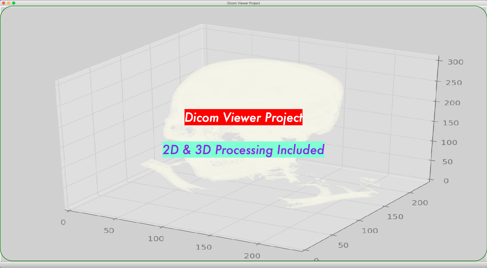
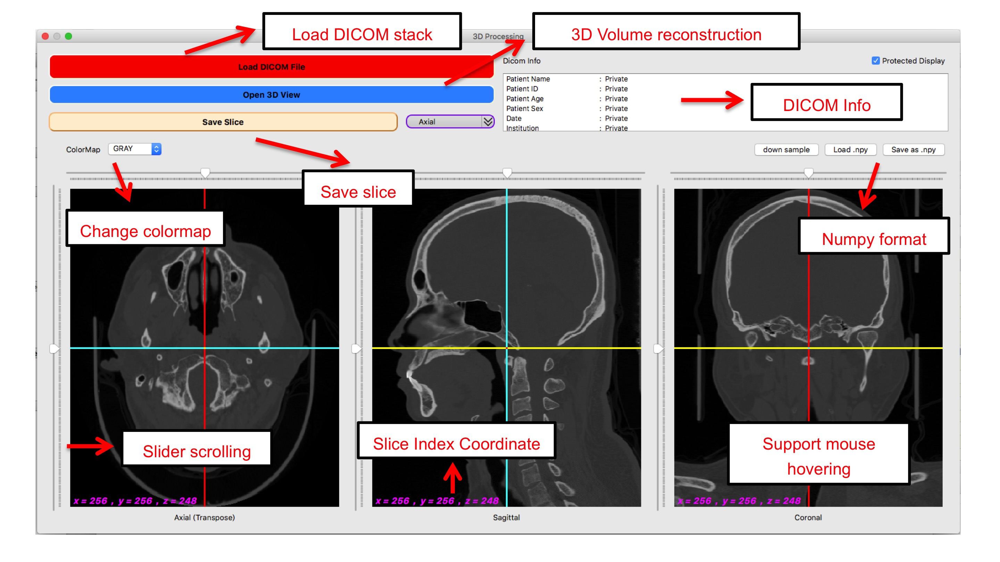
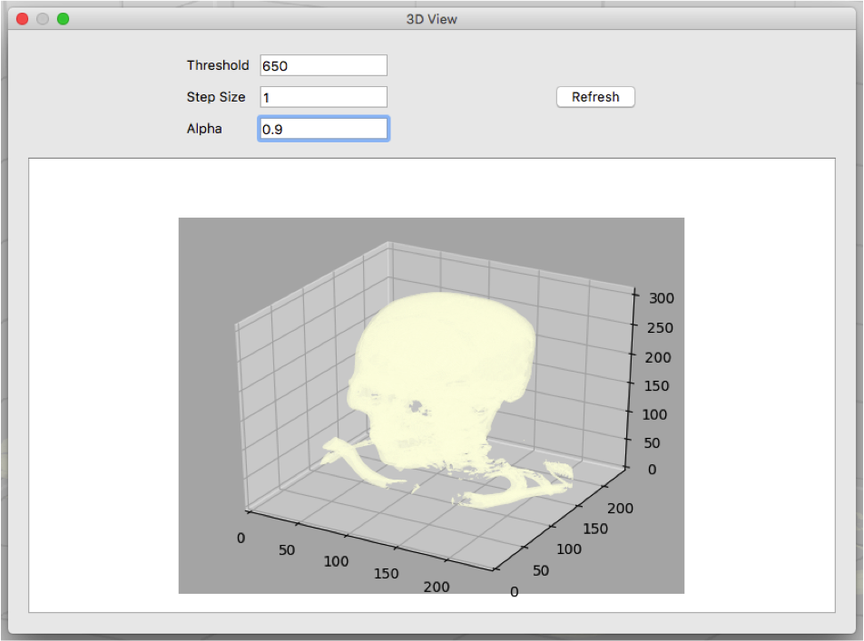

  
  <h2 align="center">Simple Medical Imaging GUI (Dicom Viewer)</h2>
  
 can show 2D/3D Dicom Image Applications

   

This project aims to create a simple medical imaging GUI using python+Qt, providing a platform on which to develop and test various image processing functions using python, especially the Dicom Stack for 3D!

## Let's see two demos first
###  <a href="https://www.youtube.com/watch?v=TOXczNnnZ4c&feature=youtu.be">2D Image Processing</a>
### <a href="https://www.youtube.com/watch?v=NS75AQOVOss&feature=youtu.be">3D Image Processing</a>
  
## Execution Screen
The execution style will open the Main Window, the menu in the upper left corner has two sub-options 2D processing and 3D processing, the latter embed has 3D volume reconstruction function

### Main Window

### 2D processing
Included Features
- Load Image (*.dcm)
- Save Image
- Convert to gray scale
- Restore
- Thresholding
- Region Growing
- Morthology (Dilation, Erosion, Opening, Closing)
- Edge Detection (Laplacian, Sobel, Perwitt, Frei & Chen)
- Drawing
 

### 3D processing
Included Features
- Load DICOM stack
- Save slice (axial, sagittal, coronal)
- Colormap transform
- Slider scrolling
- Mouse hovering/clicking
- Show DICOM info
- Show slice index coordinate
- 3D volume reconstruction
 

### 3D volume reconstruction
 

## Future Extension
- Add data analysis function
    >Introduce some medical knowledge to give the software some preliminary analysis functions (e.g. no fractures, tumors, etc.)
- 3D reconstruction Improvements
    >Update the volume reconstruction algorithm to improve the calculation speed and restore degree
- 3D image processing
    >Add more complex image processing functions for 3D voxel images
- Make it distributable
    >It is packaged as a release version to become a redistributable software. I hope it can support cross-platform operation (window, macOS)
    
## How to use it?
Project root will be **/src**, just clone it and run mainwindow.py.

Strictly follow the package version in requirements.txt is not necessary.

## Acknowledgments
- [brain.png](https://github.com/wenyalintw/Dicom-Viewer/blob/master/resources/brain.png) licensed under "CC BY 3.0" downloaded from [ICONFINDER](https://www.iconfinder.com/icons/1609653/brain_organs_icon) 
- 3D volumn reconstruction modified from [Howard Chen's Post](https://www.raddq.com/dicom-processing-segmentation-visualization-in-python/)
